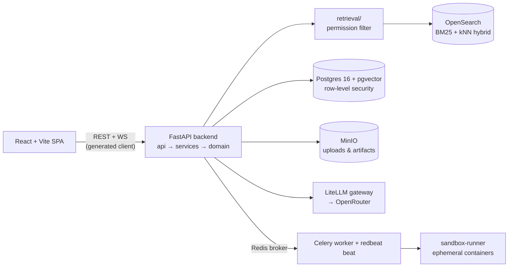

# lumen-copilot — an enterprise knowledge copilot that answers only what you're allowed to know, with receipts

Multi-tenant, Glean-style Work-AI assistant: grounded RAG chat over an organization's documents and connected sources, where every answer is **permissioned, cited, and auditable** — plus custom assistants, a governed tool platform (MCP included), per-tenant encrypted secrets, scheduled headless runs, and sandboxed code execution.

## The problem

Generic chatbots are unusable inside a regulated organization: they answer confidently without sources, leak across permission boundaries, and leave no trail for the compliance team. An enterprise copilot has to invert those defaults — never surface a passage the asking user couldn't already open, refuse rather than guess when there's no source, and emit an audit event for every retrieval, answer, and action. Lumen Copilot is a from-scratch implementation of that discipline, enforced by architecture chokepoints and negative tests rather than by prompt-side promises.

## What it does

- **Grounded chat with citations** — answers stream over WebSocket and cite the exact source passages retrieval returned; an uncited or permission-violating citation is structurally blocked (INV-3), so "confident but unsourced" never reaches the user.
- **Permissioned hybrid retrieval** — one OpenSearch query fuses min-max-normalized BM25 with kNN vectors, and the caller's permission filter is applied *inside* the retrieval module (INV-1/INV-2) — the single chokepoint no feature can forget to call.
- **Custom assistants with governance** — saved, immutably versioned assistant configs (instructions, tool allow-list, knowledge scope, model, autonomy level) run on the same chat runtime; a shared assistant's scope can only *narrow* what its runner could already retrieve, never widen it.
- **Tool platform + MCP** — first-party tools (retrieval, web search, Python execution, file write) carry T0–T3 risk tiers where consequential (T2+) tools structurally require approval (INV-7); per-tenant MCP server registration plugs external tools through the same governance and a single SSRF egress guard shared with the connector framework.
- **Per-tenant encrypted secrets vault** — envelope-encrypted credentials (MCP auth, search keys) behind a write-only API: plaintext is reachable only in-process at invoke time, never via any HTTP route — an architecture test fails if a router ever imports the decryption path.
- **Scheduled runs + sandboxed code execution** — Postgres-authoritative schedules fire headless runs via celery-redbeat; Python tool runs execute in single-use, network-none, read-only-rootfs, non-root containers launched by an isolated runner service — the only component holding a Docker socket (off by default).
- **Eval from day one** — a golden-set evaluation harness scores retrieval recall, citation correctness, and groundedness on every offline test pass, and can run the same corpus against a live model.

## Architecture



- **`contracts/`** (OpenAPI + WebSocket envelope schemas) is the FE/BE source of truth: the wire is frozen first, then backend and frontend are built in parallel and the SPA's API client is generated — no drift by construction.
- **Backend layering is one-directional** (`api/ → services/ → domain/`, adapters off `services/`), and every external system lives behind exactly one named module (LLM, retrieval, search, storage, connectors, MCP, realtime). Mission invariants each get one chokepoint: permissions in `retrieval/`, citations in the chat runtime, audit through one sink, SSRF in one shared egress guard.
- **OpenSearch is the single retrieval store**: lexical BM25 and vector kNN in one engine and one ranked query, instead of stitching two stores and re-ranking client-side.
- **Postgres + row-level security** backs tenancy at the database layer, so cross-tenant reads fail even if application code slips.
- **Redis** does triple duty as cache, Celery broker, and WebSocket pub/sub backplane — one infra piece, three jobs, laptop-sized.
- **`sandbox-runner`** is the only service mounting the Docker socket; the worker only speaks HTTP to it, and each code run gets a disposable, resource-capped container.
- The SPA ships an in-app **`/docs`** browser (renders this repo's markdown) and a **`/features`** catalog where every shipped feature links to its ADR/spec/PR — a test fails if a link rots.

## Quickstart

Requires Docker (with compose). Cold start to a running UI:

```bash
git clone https://github.com/k-sandhu/lumen-copilot.git && cd lumen-copilot
cp .env.example .env            # safe local-dev defaults; set OPENROUTER_API_KEY for model calls
docker compose up --build       # Postgres+pgvector, OpenSearch, Redis, MinIO, SearXNG, API, worker, beat, SPA
docker compose exec backend python -m app.auth.seed   # dev user: dev@acme.test / devpass
```

Then open the app at **http://localhost:47180** (API docs at http://localhost:47181/docs). LLM calls route through OpenRouter — export `OPENROUTER_API_KEY` in your shell or set it in `.env`; everything else runs with the shipped local-dev defaults.

Sandboxed code execution is off by default and gated behind a compose profile: `docker compose --profile sandbox up` additionally starts the `sandbox-runner`, which expects the runner/runtime images (`lumen-sandbox-runner`, `lumen-sandbox-py`) to be available to your Docker daemon — they are provisioned per-deploy and not published publicly. The default stack runs fully without them.

## Evaluation & tests

- **~2,000 automated tests**: 1,048 backend test functions (pytest, 94 files) and 930+ frontend cases (Vitest, 139 files). The backend suite is offline by default — tests that open real network sockets are marked `live` and opt-in via `RUN_LIVE=1`.
- **Negative tests are mandatory**, keyed to the security invariants in [spec 0004](docs/specs/0004-security-and-domain-invariants.md): cross-tenant access → 404, unauthorized passage → excluded from retrieval, uncited answer → blocked, missing token → 401, wrong role → 403, missing audit event → test failure, unapproved consequential action → forbidden.
- **Grounded-answer eval harness** ([`backend/tests/eval/`](backend/tests/eval/)): a golden Q/A-with-source set scored on retrieval recall, citation correctness, and groundedness — deterministic fakes in CI-safe mode, the same corpus against a real model in live mode.
- **Decision record trail**: [15 ADRs](docs/architecture/) and [5 specs](docs/specs/) cover the stack, module boundaries, retrieval engine, assistant runtime, MCP integration, sandbox design, and scheduling — the repo is built agent-first, with [AGENTS.md](AGENTS.md) as the canonical working contract.

## Stack

| Layer | Choice |
|---|---|
| Backend | Python 3.12 · FastAPI (async) · SQLAlchemy 2.0 + Alembic · Celery + redbeat |
| Frontend | React 18 · Vite · TypeScript · generated OpenAPI client |
| Contract | OpenAPI 3 + WebSocket envelope JSON Schemas (`contracts/`) |
| Data | PostgreSQL 16 + pgvector (RLS) · OpenSearch 2.19 (BM25 + kNN) · Redis 7.4 · MinIO |
| LLM | LiteLLM gateway → OpenRouter (provider-swappable, streaming) |
| Web search | Self-hosted SearXNG (off by default) |
| Sandbox | Dedicated runner service + ephemeral OCI containers (compose profile `sandbox`) |
| Local run | One `docker compose up` (9 services, version-pinned images; the sandbox runner is a 10th behind the `sandbox` profile) |

## Status

Solo-built portfolio project implementing production-shaped enterprise patterns (contract-first delivery, invariant-driven negative tests, ADR trail) on a laptop-sized compose stack — runs end-to-end locally; not hardened by real production traffic.

## License

[MIT](LICENSE)
